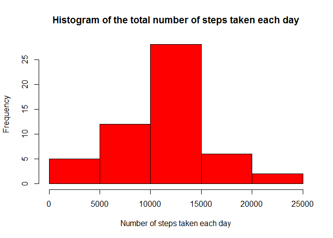
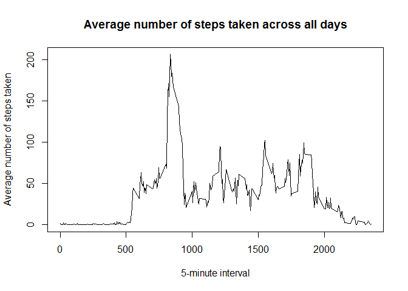
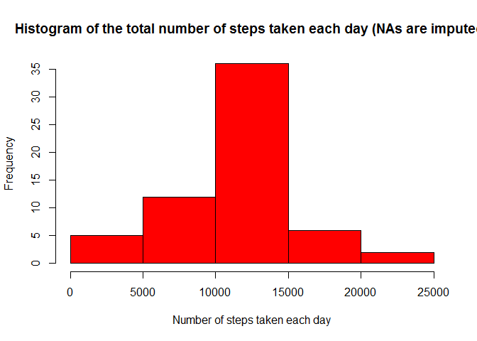
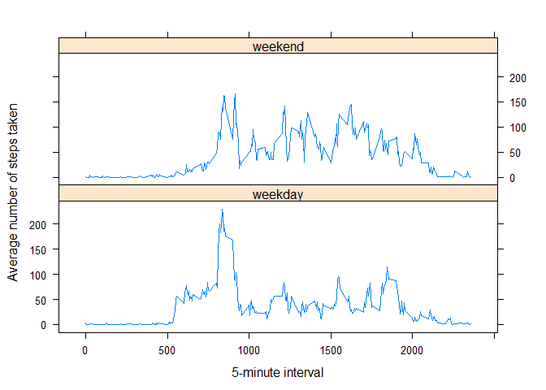

## Loading and preprocessing the data

1. Load the data.


```r
# Read data set
if(!file.exists("../original_data_set")){dir.create("../original_data_set")}
data_set_url <- "https://d396qusza40orc.cloudfront.net/repdata%2Fdata%2Factivity.zip"
download.file(data_set_url,
              destfile="../original_data_set/activity.zip")

# Unzip dataSet
unzip(zipfile="../original_data_set/activity.zip",
      exdir="../original_data_set")

activity_table <- read.table("../original_data_set/activity.csv", 
                        header=TRUE, quote="\"", sep=",", na.strings = "NA", 
                        colClasses = c('numeric','character','numeric'))
```

2. Process/transform the data (if necessary) into a format suitable for your analysis.


```r
# Convert the Date variable to Type Date
activity_table$date <- as.Date(activity_table$date, "%Y-%m-%d")
# Remove incomplete observation
activity_table_no_NA <- activity_table[complete.cases(activity_table),]
```

## What is mean total number of steps taken per day?
1. Make a histogram of the total number of steps taken each day.


```r
steps_taken_each_day <- aggregate(steps ~ date, activity_table_no_NA, sum)

hist(steps_taken_each_day$steps, 
     main="Histogram of the total number of steps taken each day", 
     xlab = "Number of steps taken each day", 
     col="red")
```

<!-- -->

2. Calculate and report the mean and median total number of steps taken per day.


```r
steps_taken_each_day_mean <- mean(steps_taken_each_day$steps)
print(steps_taken_each_day_mean)
```

```
## [1] 10766.19
```

```r
steps_taken_each_day_median <- median(steps_taken_each_day$steps)
print(steps_taken_each_day_median)
```

```
## [1] 10765
```

> **Answer:**
> 
> Mean total number of steps taken per day: 10766.1886792453 
>
> Median total number of steps taken per day: 10765 


## What is the average daily activity pattern?

1. Make a time series plot (i.e. type = "l") of the 5-minute interval (x-axis) and the average number of steps taken, averaged across all days (y-axis)


```r
average_steps_interval <- 
  aggregate(steps ~ interval, FUN=mean, data=activity_table_no_NA)

plot(x=average_steps_interval$interval
     , y=average_steps_interval$steps
     , type="l"
     , main="Average number of steps taken across all days"
     , xlab="5-minute interval"
     , ylab="Average number of steps taken")
```

<!-- -->

2. Which 5-minute interval, on average across all the days in the dataset, contains the maximum number of steps?


```r
interval_contains_max_steps <- 
  average_steps_interval$interval[which.max(average_steps_interval$steps)]

print(interval_contains_max_steps)
```

```
## [1] 835
```

> **Answer:** 
> 
> The maximum number of steps occurred during interval **835**.. This indicates that people are active in the early part of the day.

## Imputing missing values

1. Calculate and report the total number of missing values in the dataset (i.e. the total number of rows with NAs)


```r
total_number_of_missing_values <- sum(is.na(activity_table$steps))
print(total_number_of_missing_values)
```

```
## [1] 2304
```

2. Devise a strategy for filling in all of the missing values in the dataset. The strategy does not need to be sophisticated. For example, you could use the mean/median for that day, or the mean for that 5-minute interval, etc.
3. Create a new dataset that is equal to the original dataset but with the missing data filled in.


```r
activity_table_impute_NA <- activity_table

for (i in 1:nrow(activity_table_impute_NA)) {
  if(is.na(activity_table_impute_NA$steps[i])) {
    filling_value <- average_steps_interval$steps[which(average_steps_interval$interval 
                                              == activity_table_impute_NA$interval[i])]
    activity_table_impute_NA$steps[i] <- filling_value 
  }
}
```

4. Make a histogram of the total number of steps taken each day and Calculate and report the mean and median total number of steps taken per day. Do these values differ from the estimates from the first part of the assignment? What is the impact of imputing missing data on the estimates of the total daily number of steps?


```r
steps_taken_each_day_impute_NA <- aggregate(steps ~ date, 
                                            activity_table_impute_NA, sum)
hist(steps_taken_each_day_impute_NA$steps, 
     main="Histogram of the total number of steps taken each day (NAs are imputed)", 
     xlab = "Number of steps taken each day", 
     col="red")
```

<!-- -->

```r
steps_taken_each_day_mean_impute_NA <- 
  mean(steps_taken_each_day_impute_NA$steps)
print(steps_taken_each_day_mean_impute_NA)
```

```
## [1] 10766.19
```

```r
steps_taken_each_day_median_impute_NA <- 
  median(steps_taken_each_day_impute_NA$steps)
print(steps_taken_each_day_median_impute_NA)
```

```
## [1] 10766.19
```

> **Answer:** 
>
> Mean with imputing missing data: 10766.1886792453 
>
> Median with imputing missing data: 10766.1886792453 
>
> > Mean without missing data: 10766.1886792453 
> >
> > Median without missing data: 10765 
>
> **Impact of imputing missing data**: There is no impact to the mean; however, imputing missing data changed median slightly.

## Are there differences in activity patterns between weekdays and weekends?

1. Create a new factor variable in the dataset with two levels -- "weekday" and "weekend" indicating whether a given date is a weekday or weekend day.


```r
activity_table_impute_NA$weekdays <- 
  as.factor(ifelse(weekdays(activity_table_impute_NA$date) %in% 
                     c("Saturday", "Sunday"), "weekend", "weekday"))
```

2. Make a panel plot containing a time series plot (i.e. type = "l") of the 5-minute interval (x-axis) and the average number of steps taken, averaged across all weekday days or weekend days (y-axis). 


```r
library(lattice)

average_steps_interval <- aggregate(steps ~ interval + weekdays, FUN=mean, 
                                    data=activity_table_impute_NA)

xyplot(steps ~ interval | weekdays, 
       data = average_steps_interval, 
       type = "l", 
       layout = c(1, 2), 
       xlab = "5-minute interval", 
       ylab = "Average number of steps taken")
```

<!-- -->

> **Answer:** 
>
>The panel plot indicates differences in activity patterns between weekdays and weekends. Weekends, users start activity later than weekday and keep higher activity throughout the day than weekday.

